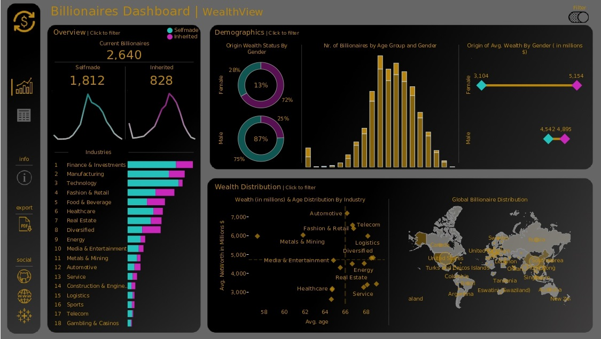
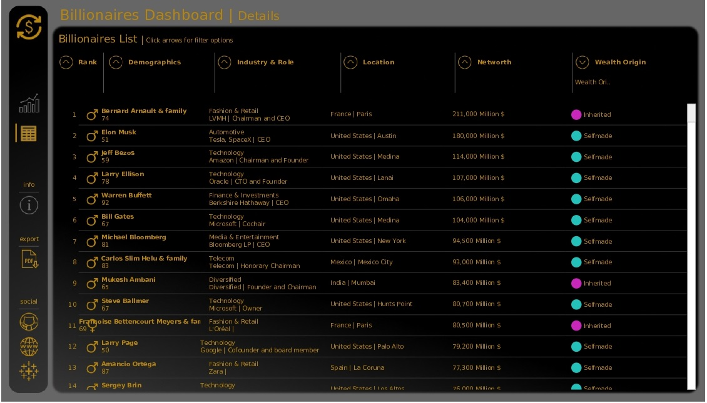

# 💰 Billionaires Project  

## Info-Data

My engagement with the market and investments was the initial driving force behind this project. Wanting to explore the world's wealthiest individuals, so here i use data visualization to analyze the trends, industries, and countries that dominate the billionaire landscape. The dataset contains statistics on the world's billionaires, including information about their businesses, industries, and personal details. It provides insights into the wealth distribution, business sectors, and demographics of billionaires worldwide from [kaggle](https://www.kaggle.com/datasets/nelgiriyewithana/billionaires-statistics-dataset)

## Key Takeaways

- The project includes 2 dashboards. The first contains visuals and insights on the world's billionaires about their industries, sectors, wealth origin, global distribution and wealth distribution by industry. The second provides  a detailed list of all the billionaires describing rank, location, demograghics, role and industry, networth and wealth origin.
- Self-made billionaires lead with 68.6%, while inherited accounts for 31.4%.
- Male billionaires dominate with 87%, while female billionaires make up 13%.
- The age group with the highest number of billionaires is 55-59, with a total of 44 billionaires.
- The top three industries with the highest number of billionaires are Financial & Investments (372), Manufacturing (324), and Technology (314).
- The USA and China dominate with 754 and 523 billionaires, respectively.

## 📊 Dashboards

🔗 [Tableau Link](https://public.tableau.com/app/profile/theodoros.malezidis7413/viz/BillionairesDashboard_17390158115780/BillionairesDashboardWealthView)

- WealthView

- Details

